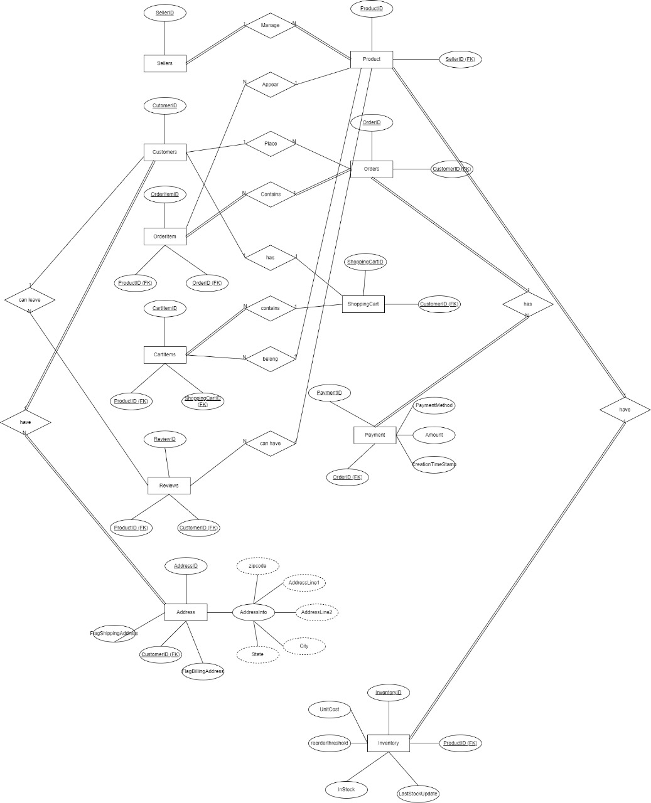

# E-Commerce Database System: README
**Overview**

This project involves designing and implementing a relational database system for an e-commerce platform. The system allows customers to browse and purchase products offered by sellers, manage shopping carts, place orders, and make payments. Additionally, customers can leave reviews for products and manage multiple shipping and billing addresses. The system also includes inventory management for tracking product availability.

**This document provides:**

* A detailed explanation of the Entity-Relationship Diagram (ERD)
* SQL implementation details
* Challenges faced during design and implementation
* Solutions applied to overcome those challenges

# ERD Explanation:
The ERD illustrates the various entities, their relationships, and key attributes within the system. Below is a breakdown of the entities and relationships in this system, along with their corresponding SQL structure.

# 1. Entities and Attributes
# Sellers
## Description: 
Sellers manage multiple products and are responsible for their inventory and sales.
## Attributes:
* SellerID (Primary Key)
* SellerName
* ContactInfo

**sql:**

    CREATE TABLE Sellers (
        SellerID INT PRIMARY KEY,
        SellerName VARCHAR(255),
        ContactInfo VARCHAR(255)
    );

# Products
## Description: 
Products are the items that customers can purchase.
## Attributes:
* ProductID (Primary Key)
* ProductName
* Description
* Price
* SellerID (Foreign Key)

 **sql:**

    CREATE TABLE Products (
        ProductID INT PRIMARY KEY,
        ProductName VARCHAR(255),
        Description TEXT,
        Price DECIMAL(10, 2),
        SellerID INT,
        FOREIGN KEY (SellerID) REFERENCES Sellers(SellerID)
    );

# Customers
## Description: 
Customers place orders, leave reviews, and manage their shopping carts and addresses.
## Attributes:
* CustomerID (Primary Key)
* FirstName
* LastName
* Email

**sql**

    CREATE TABLE Customers (
        CustomerID INT PRIMARY KEY,
        FirstName VARCHAR(255),
        LastName VARCHAR(255),
        Email VARCHAR(255)
    );

# Orders
## Description: 
Orders contain multiple products placed by customers.
## Attributes:
* OrderID (Primary Key)
* OrderDate
* CustomerID (Foreign Key)

**sql**

    CREATE TABLE Orders (
        OrderID INT PRIMARY KEY,
        OrderDate DATETIME,
        CustomerID INT,
        FOREIGN KEY (CustomerID) REFERENCES Customers(CustomerID)
    );

# ShoppingCart
## Description: 
Customers use shopping carts to hold products before making a purchase.
## Attributes:
ShoppingCartID (Primary Key)
CustomerID (Foreign Key)

**sql**

    CREATE TABLE ShoppingCart (
        ShoppingCartID INT PRIMARY KEY,
        CustomerID INT,
        FOREIGN KEY (CustomerID) REFERENCES Customers(CustomerID)
    );

# Payment
## Description: 
Payments are associated with each order and include payment details.
## Attributes:
* PaymentID (Primary Key)
* OrderID (Foreign Key)
* Amount
* PaymentMethod
* PaymentDate

**sql**

    CREATE TABLE Payments (
        PaymentID INT PRIMARY KEY,
        OrderID INT,
        Amount DECIMAL(10, 2),
        PaymentMethod VARCHAR(50),
        PaymentDate DATETIME,
        FOREIGN KEY (OrderID) REFERENCES Orders(OrderID)
    );

# Reviews
## Description: 
Customers can leave reviews for the products they've purchased.
## Attributes:
* ReviewID (Primary Key)
* ProductID (Foreign Key)
* CustomerID (Foreign Key)
* ReviewText
* Rating

**sql**

    CREATE TABLE Reviews (
        ReviewID INT PRIMARY KEY,
        ProductID INT,
        CustomerID INT,
        ReviewText TEXT,
        Rating INT,
        FOREIGN KEY (ProductID) REFERENCES Products(ProductID),
        FOREIGN KEY (CustomerID) REFERENCES Customers(CustomerID)
    );

# Address
## Description: 
Customers have multiple addresses for shipping and billing purposes.
## Attributes:
* AddressID (Primary Key)
* CustomerID (Foreign Key)
* AddressLine1
* AddressLine2
* City
* State
* Zipcode
* AddressType (Shipping or Billing)

**sql**

    CREATE TABLE Addresses (
        AddressID INT PRIMARY KEY,
        CustomerID INT,
        AddressLine1 VARCHAR(255),
        AddressLine2 VARCHAR(255),
        City VARCHAR(100),
        State VARCHAR(100),
        Zipcode VARCHAR(20),
        AddressType VARCHAR(50),
        FOREIGN KEY (CustomerID) REFERENCES Customers(CustomerID)
    );

# Inventory
## Description: 
Inventory tracks product availability.
## Attributes:
* InventoryID (Primary Key)
* ProductID (Foreign Key)
* Quantity
* LastStockUpdate

**sql**

    CREATE TABLE Inventory (
        InventoryID INT PRIMARY KEY,
        ProductID INT,
        Quantity INT,
        LastStockUpdate DATETIME,
        FOREIGN KEY (ProductID) REFERENCES Products(ProductID)
    );

# 2. Relationships in the ERD
The relationships between the entities in the e-commerce system are vital for maintaining the integrity of the data and the overall functionality of the platform.

# Sellers and Products
## Relationship: 
Sellers manage multiple products. This is a one-to-many relationship, where a seller can manage multiple products.

## SQL Implementation: 
The SellerID is a foreign key in the Products table, ensuring each product belongs to one seller.

# Customers and Orders
## Relationship:
Customers can place multiple orders, but each order is associated with only one customer. This is a one-to-many relationship.

## SQL Implementation: 
The CustomerID is a foreign key in the Orders table.

# Orders and Products
## Relationship: 
Each order can contain multiple products, and each product can appear in multiple orders. This is a many-to-many relationship.

## SQL Implementation: 
An associative table called OrderDetails (not shown in the ERD) can be used to store this relationship.

**sql**

    CREATE TABLE OrderDetails (
        OrderID INT,
        ProductID INT,
        Quantity INT,
        FOREIGN KEY (OrderID) REFERENCES Orders(OrderID),
        FOREIGN KEY (ProductID) REFERENCES Products(ProductID),
        PRIMARY KEY (OrderID, ProductID)
    );

# Customers and Shopping Cart
## Relationship:
Each customer has one shopping cart, but a shopping cart can contain multiple products. This is a one-to-one relationship between customers and carts, but a many-to-many relationship between shopping carts and products.

## SQL Implementation: 
The CustomerID is a foreign key in the ShoppingCart table, and another associative table like CartItems would store the products in the cart.

**sql**

    CREATE TABLE CartItems (
        CartItemID INT PRIMARY KEY,
        ShoppingCartID INT,
        ProductID INT,
        Quantity INT,
        FOREIGN KEY (ShoppingCartID) REFERENCES ShoppingCart(ShoppingCartID),
        FOREIGN KEY (ProductID) REFERENCES Products(ProductID)
    );

# Customers and Addresses
## Relationship: 
Customers can have multiple addresses (shipping and billing). This is a one-to-many relationship.

## SQL Implementation: 
The CustomerID is a foreign key in the Addresses table.

# Challenges and Solutions
# 1. Handling Many-to-Many Relationships
## Challenge: 
Managing the many-to-many relationship between Orders and Products was complex because a single order can contain multiple products, and a product can appear in multiple orders.
## Solution: 
We introduced a junction table (OrderDetails) to break down the many-to-many relationship into two one-to-many relationships.

# 2. Address Normalization
## Challenge: 
Ensuring that customers can have multiple addresses while maintaining a normalized structure.
## Solution: 
Created an Addresses table where each address is linked to a CustomerID and contains fields for address type (shipping or billing).

# 3. Inventory Management
## Challenge: 
Managing real-time inventory levels when orders are placed or canceled.
## Solution: 
An Inventory table was created to track each product’s stock. When an order is placed, a trigger can be added to update the stock level in real-time.

# 4. Ensuring Data Integrity
## Challenge: 
Maintaining referential integrity and consistency across relationships.
## Solution: 
Foreign key constraints were added to enforce relationships between tables, and cascading actions (ON DELETE CASCADE, ON UPDATE CASCADE) were implemented to handle updates and deletions appropriately.

# Conclusion
This e-commerce system's database design incorporates all essential elements to support sellers, products, customers, orders, shopping carts, reviews, payments, and inventory. By using an ERD to visually design the relationships, and carefully applying normalization and referential integrity, the system is scalable, efficient, and maintains data accuracy.

The ERD and SQL implementation together form a robust foundation for any e-commerce platform, ensuring seamless interactions between users and the database.

# ERD DIAGRAM: 

## 👥 Team & Course Info

- **Course**: Database Systems
- **Group Size**: 2 Members
- **Instructor Requirement**: Viva mandatory for marks

